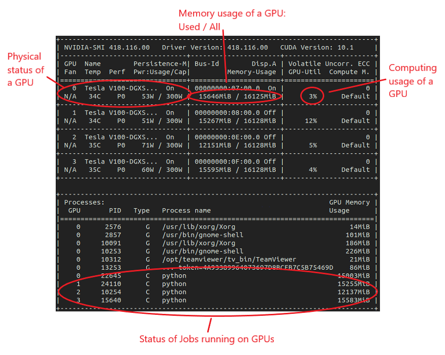
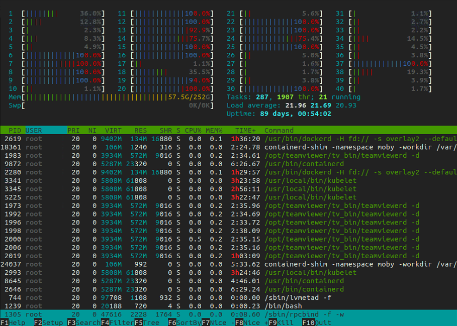
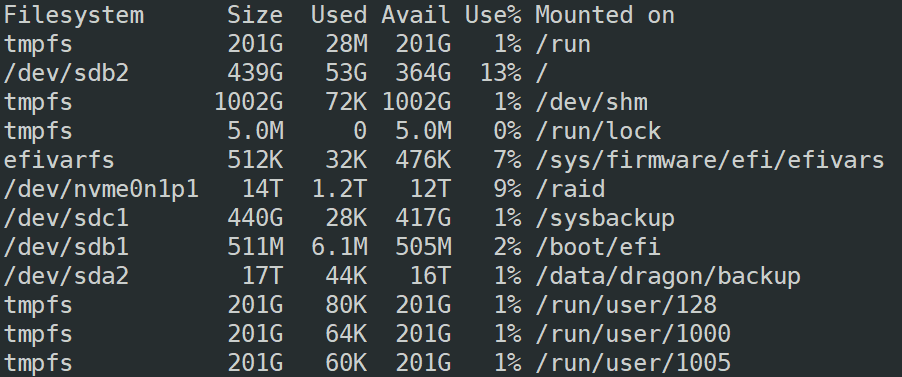

# Run Jobs

## Prepare the Environment

In order to run a job, a proper environment has to be prepared at first.

### 1. Choose a Docker Image

It is highly recommended to run your job inside a Docker image container. You can find more information in the [Docker tutorial](https://compsci-hunter.gitbook.io/xie-research-group/useful-tutorials/docker-tutorial) page.

### 2. Check the system status

Before running your jobs, another thing has to be done is to check the status of the system. By doing so, we can answer about the following questions:

> How many resources should/can I use for my job?

> Which GPU should I run my job on?

> Can I run my job now on a HPC?

The following commands are useful to moniter the status of the system as well as the jobs running: `nvidia-smi`,  `htop` and `df -lh`.

#### GPU Usage:

The `nvidia-smi` command is powerful to see the current usage of GPUs as well as the jobs on each GPU. Below is an example after using `nvidia-smi`:



From the information, we can see which GPU has enough memory for running a job. In the example, only the GPU with number 2 has \~4000MB spare memory.


Do not try to run a new job on a GPU with fully-loaded memory, otherwise the old jobs on the GPU might be affected and stopped.


#### CPU Usage:

The `htop` command can show all of the jobs running on the machine as well as the usage of CPU and system memory:



For more details about the `htop` command, please refer to the [official website](https://hisham.hm/htop/).

#### Disk Usage:

The `df -lh` command can help you to check the usage of the disks:

<figure><figcaption></figcaption></figure>


If the disk mounted on `/` or `/raid` is full, it would be not possible to run jobs or run commands on the machine. Be sure to always remove useless data or move unused data to the [backup disk](https://compsci-hunter.gitbook.io/xie-research-group/hpc-environments/hpc-user-guide/data-backup#id-1.-backup-directories).


## Submit a Job

### Job on GPU

For GPU jobs, the bottleneck is the GPU memory used. If the GPU does not have enough memory to run the job, error like

```
RuntimeError: CUDA error: out of memory
```

will be raised.

Since each GPU has 16GB memory on DGX and 32GB memory on DLS, using single GPU is enough in most cases.

For example, you can specify the GPU device for your python job by using the command:

```
CUDA_VISIBLE_DEVICES=N python XXXX.py
```

N is the GPU device number for `XXXX.py` file to run on it (N can be 0~~3 on DGX and 0~~7 on DLS). Please check the status of GPUs (using the command `nvidia-smi`) before running your job to decide an N number.

## Monitor a Job

After submitting a job, users can use `nvidia-smi` and `htop` to check the GPU and CPU status of the job.

If you find your GPU job uses a very small amount of the computations on the GPU (e.g. the `Volatile GPU-Util` is close to 0% all the time) via `nvidia-smi`, it is possible that there are issues in your code.
