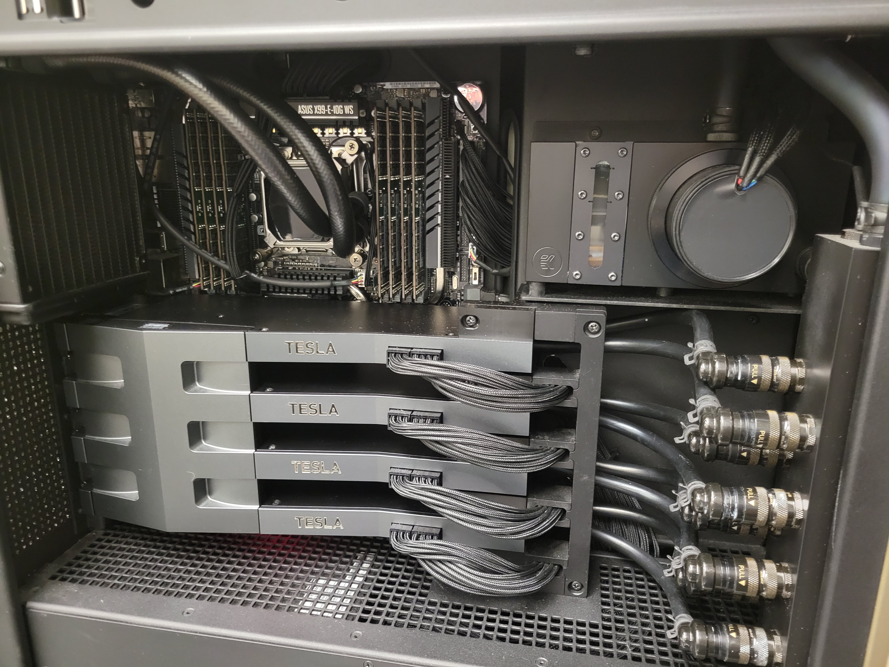

# DGX (Group)

The DGX-Lei Workstation (DGX) in Dr. Lei Xie's group is the NVIDIA® DGX Station™, which is the world’s first personal supercomputer for leading-edge AI development.

<figure><figcaption></figcaption></figure>

 

<figure><figcaption></figcaption></figure>

## Features of DGX Station

Deep learning platforms require software engineering expertise to keep today’s frameworks optimized for maximum performance, with time spent waiting on stable versions of open-source software. This means hundreds of thousands of dollars in lost productivity, dwarfing the initial hardware cost.

NVIDIA DGX Station includes the same software stack found in all DGX solutions. This innovative, integrated system includes access to popular deep learning frameworks, updated monthly, each optimized by NVIDIA engineers for maximized performance. It also includes access to NVIDIA DIGITS™ deep learning training application, third-party accelerated solutions, the NVIDIA Deep Learning SDK (e.g. cuDNN, cuBLAS, NCCL), CUDA® Toolkit, and NVIDIA drivers.

Built on container technology powered by NVIDIA Docker, this unified deep learning software stack simplifies workflow, saving you days in a re-compilation time when you need to scale your work and deploy your models in the data center or cloud.

## Hardware Summary

### Processors

| Component | Qty | Description                                                       |
| --------- | --- | ----------------------------------------------------------------- |
| CPU       | 2   | Intel Xeon E5-2698 v4 2.2 GHz 20-Core (40-core total)             |
| GPU       | 4   | NVIDIA Tesla® V100 with 16 GB per GPU (64 GB total) of GPU memory |

### System Memory and Storage

| Component                        | Qty | Unit Capacity | Total Capacity | Description                                      |
| -------------------------------- | --- | ------------- | -------------- | ------------------------------------------------ |
| System memory                    | 8   | 32 GB         | 256 GB         | ECC Registered LRDIMM DDR4 SDRAM                 |
| Data storage                     | 3   | 1.92 TB       | 5.76 TB        | 2.5” 6 Gb/s SATA III SSD in RAID 0 configuration |
| OS storage                       | 1   | 1.92 TB       | 1.92 TB        | 2.5” 6 Gb/s SATA III SSD                         |
| External data storage for backup | 1   | 8 TB          | 8 TB           | Hard Disk                                        |

Read more at: [http://docs.nvidia.com/dgx/dgx-station-user-guide/index.html](http://docs.nvidia.com/dgx/dgx-station-user-guide/index.html)

## Administrators

If you have any problems with using the DGX. Please contact the administrators of DGX-Lei workstation:

| Name       | Email                                                             |
| ---------- | ----------------------------------------------------------------- |
| Shuo Zhang | [szhang4@gradcenter.cuny.edu](mailto:szhang4@gradcenter.cuny.edu) |
