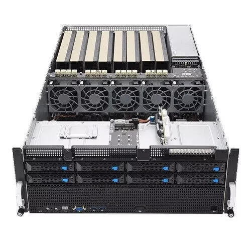

# Dragon (Group)

ESC8000A-E11

<figure><figcaption></figcaption></figure>

## Hardware Summary

### Processors

<table><thead><tr><th width="162">Component</th><th width="58.333333333333314">Qty</th><th>Description</th></tr></thead><tbody><tr><td>CPU</td><td>2</td><td>AMD EPYC 7453 CPU 28C (112 threads total)</td></tr><tr><td>GPU</td><td>8</td><td>Nvidia L40S - Passive PCIe 48GB GPU (384 GB total of GPU memory) </td></tr></tbody></table>

### System Memory and Storage

<table><thead><tr><th width="174">Component</th><th width="96">Qty</th><th>Unit Capacity</th><th>Total Capacity</th><th>Description</th></tr></thead><tbody><tr><td>System memory</td><td>32</td><td>64 GB</td><td>2 TB</td><td>DDR4-3200 ECC RDIMM</td></tr><tr><td>Data storage</td><td>1</td><td>15.36 TB</td><td>15.36 TB</td><td>U.3 15mm NVMe PCIe 4.0 (1DWPD) SSD</td></tr><tr><td>OS storage</td><td>1</td><td>480 GB</td><td>480 GB</td><td>SATA 2.5" SSD</td></tr><tr><td>Backup storage</td><td>1</td><td>16 TB</td><td>16 TB</td><td>Seagate External Hard Drive</td></tr></tbody></table>

## Administrators

<table><thead><tr><th width="205">Name</th><th>Email</th></tr></thead><tbody><tr><td>Shuo Zhang</td><td>szhang4@gradcenter.cuny.edu</td></tr></tbody></table>
