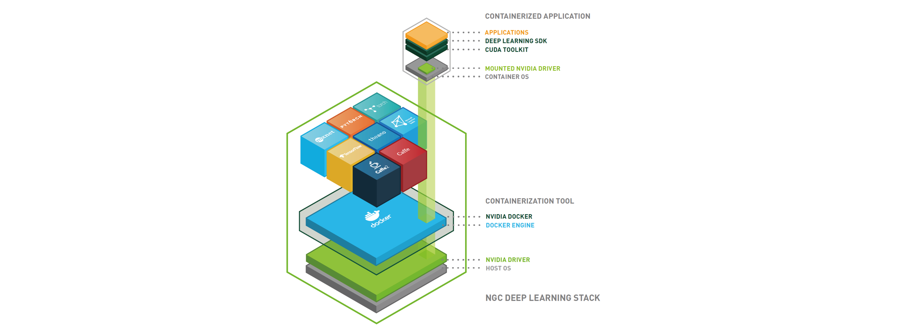

# Use Docker for Deep Learning

NVIDIA offers NVIDIA GPU Cloud (NGC), which empowers AI researchers with **performance-engineered deep learning framework containers**, allowing them to spend less time on IT, and more time experimenting, gaining insights, and driving results.

## About NVIDIA GPU Cloud (NGC)


NVIDIA GPU Cloud is a GPU-accelerated cloud platform optimized for deep learning. NGC manages a catalog of fully integrated and optimized deep learning framework containers that take full advantage of NVIDIA GPUs. These framework containers are delivered ready-to-run, including all necessary dependencies such as CUDA runtime, NVIDIA libraries, and an operating system. They are tuned, tested, and certified by NVIDIA to run on NVIDIA DGX Systems. NVIDIA updates these containers monthly to ensure they continue to provide peak performance.


The DGX and DLS machines are all [NGC-Ready Systems](https://www.nvidia.com/content/dam/en-zz/Solutions/Data-Center/ngc/ngc-ready-systems-datasheet.pdf) that can take full adavantage of the NGC.


### NGC Container Registry

The NGC container registry is a catalog of GPU-accelerated deep learning software. It includes CUDA Toolkit, DIGITS workflow, pretrained models, and the following deep learning frameworks: NVCaffe, Caffe2, Microsoft Cognitive Toolkit (CNTK), MXNet, PyTorch, TensorFlow, Theano, Torch and so on.

The NGC container registry provides containerized versions of these frameworks. These frameworks, including all necessary dependencies, form the NGC Deep Learning Stack. For users who need more flexibility to build custom deep learning solutions, each framework container image also includes the framework source code to enable custom modifications and enhancements, along with the complete software development stack.

The design of the platform software is centered around a minimal OS and driver install on the server and provisioning of all application and SDK software in NVIDIA Docker containers through NVIDIA Docker Registry.

<div align="center">



</div>

## Use NGC Service on HPCs

To use NGC Service and framework container images on HPCs, all users have to first choose a suitable image on NGC and then find whether it exists on HPCs. If so, the users can directly run it for their research purpose. If not, the users have to contact the admins to pull the corresponding image from NGC. The detailed steps are described as follows:

### 1. Choose NGC Docker Images

In order to perform your research tasks on docker container images, the first step is **choose a proper one** that contains the correct version of software you need.


In many cases, even though a deep learning framework is decided (e.g. PyTorch), the codes you want to run will only support certain versions of PyTorch and CUDA (e.g. PyTorch 1.4 and CUDA 10.2). Thus the container with mismatched version of the software will raise errors.



For the deep learning frameworks like **PyTorch, TensorFlow, MXNet, NVCaffe, Kaldi**, there are multiple versions of their container images on the NGC Container Registry which are updated every month.

To choose a proper one, two things have to be checked:

1. Check the docker images that meet your demand on \
   [https://docs.nvidia.com/deeplearning/frameworks/index.html#optimized-frameworks-release-notes](https://docs.nvidia.com/deeplearning/frameworks/index.html#optimized-frameworks-release-notes).\
   The links include what's inside the different releases of the NVIDIA container images for those deep learning frameworks.
2.  Check the docker images that already exist on the HPCs via command:

    ```
    docker images
    ```

    It will return the Docker images on your system (below is an example):

    ```
    REPOSITORY                  TAG                            IMAGE ID            CREATED             SIZE
    nvcr.io/nvidia/theano       18.01                          dc2fda091dd4        5 weeks ago         4GB
    nvcr.io/nvidia/mxnet        18.01-py3                      1a70c143e041        5 weeks ago         2.67GB
    nvcr.io/nvidia/mxnet        18.01-py2                      ffe7de2f34c3        5 weeks ago         2.64GB
    nvcr.io/nvidia/pytorch      17.12                          5ac6ff8f9a81        2 months ago        4.52GB
    nvcr.io/nvidia/tensorflow   17.12                          19afd620fc8e        2 months ago        2.88GB
    nvcr.io/nvidia/caffe2       17.12                          ac17621b6d70        2 months ago        2.8GB
    nvcr.io/nvidia/caffe        17.12                          cd94fcaaec3f        2 months ago        3.25GB
    ```

    Note that the `TAG` of each NVIDIA container image (e.g. `18.01`) is the release version of the image as listed in the links given above.

If you find your needed release of the image is not on the HPCs, please contact the admins to get it.

### 2. Get NGC Docker Images (For Admins)

1. Activate your NVIDIA DGX Cloud Services account.
2. Log on to the [NVIDIA GPU CLOUD](https://ngc.nvidia.com/signin) website. All Registries can be viewed on the website.
3.  Pull Docker images.

    Download the container that you want from the Registry:

    ```
    docker pull registry/registry-space/repository:tag
    ```

    You can click on the image in Registry you need and scroll down the web page to find the specific pull command of it. For example:

    ```
    docker pull nvcr.io/nvidia/tensorflow:18.01-py2
    ```

### 3. Use Docker Images (on DGX and DLS)

Run a container pulled from NGC:

```
nvidia-docker run --name containerName -it --network=host --shm-size=1g --rm -v local_dir:container_dir nvcr.io/nvidia/repository:<xx.xx>
```

**For example:**

If you want to run a NVIDIA container image of TensorFlow with `18.01-py3` release. Your working directory contains files is `/raid/home/user_name/workspace` , and `user_name` is your account name on the HPCs. If you want to see those files in the directory of `/workspace` in the container image, then the command to run that container image with a name of `test` will be like this:

```
nvidia-docker run --name test -it --network=host --shm-size=1g --rm -v /raid/home/user_name/workspace:/workspace nvcr.io/nvidia/tensorflow:18.01-py3
```

Then you will be able to synchronize files between these two specified directories. A more detailed explanation of this command can be found [here](http://docs.nvidia.com/ngc/ngc-user-guide/index.html#keyconcepts).

### 4. Use Docker Images (on Dragon)

The environment on Dragon needs some more flags to be specified when running docker images compared to DGX and DLS. Run a container pulled from NGC:

```
nvidia-docker run --name containerName -it --network=host --shm-size=1g --rm --gpus all --privileged -v local_dir:container_dir nvcr.io/nvidia/repository:<xx.xx>
```

**Besides, the GPUs (L40s) on Dragon only support docker images that have CUDA > 11.7, otherwise the GPUs will not be used inside the docker environment.**
